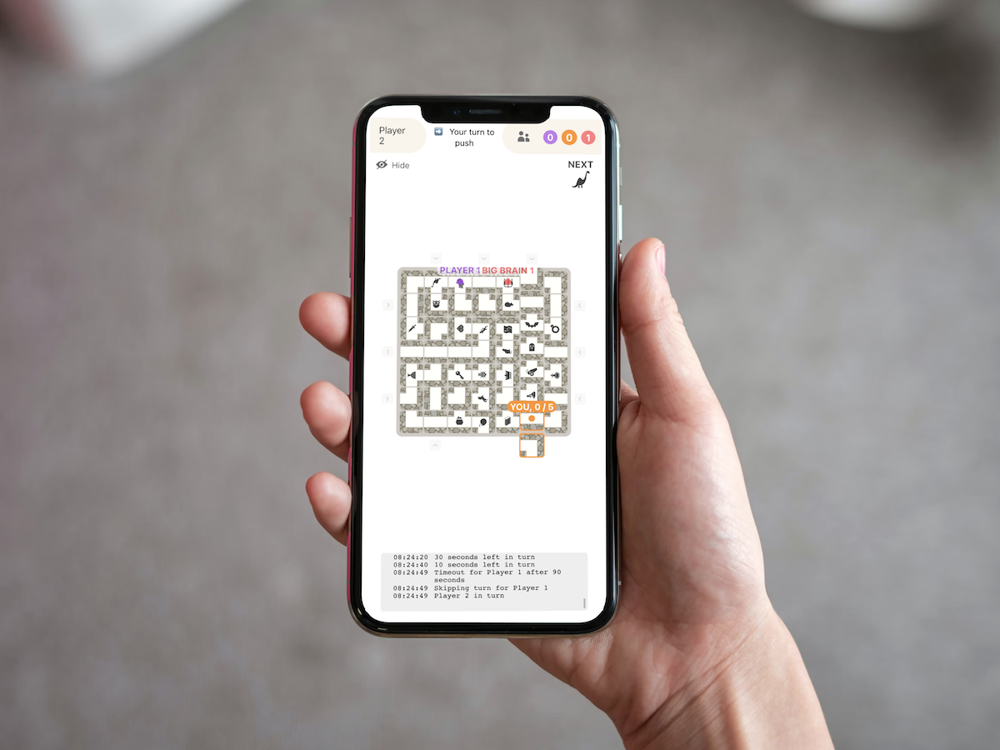
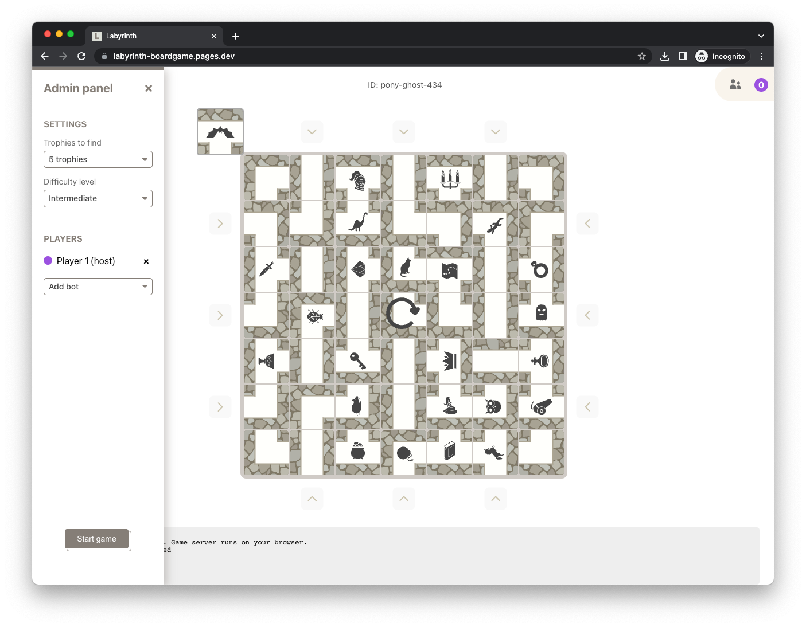
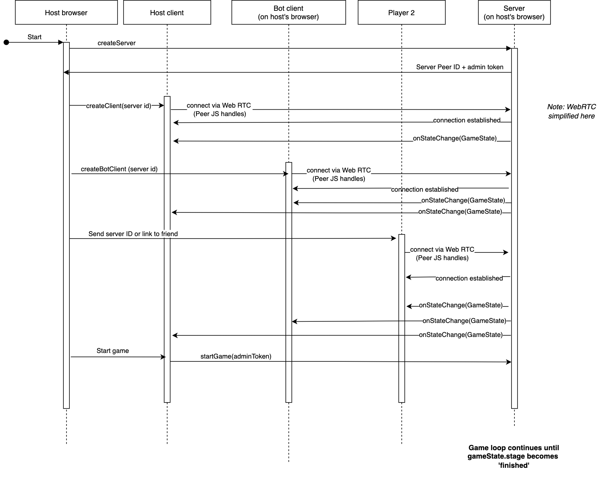

# Labyrinth

Online version of the Labyrinth board game. The game server runs
on the host's browser and networking happens peer-to-peer.

https://user-images.githubusercontent.com/1232405/208707395-7fcd2de7-a077-4243-8c76-f1398ff86db4.mov

Note: the game might be very slow on mobile, as it might fallback to a public TURN server. Workaround is to use e.g. a Wifi network.

Optimized for Chrome and iOS Safari. Uses React for the UI. _Clean React code was not the goal.._

## Get started

* `npm i`
* `npm start`
* Open http://localhost:4000 and click "Host game"

## Developing a bot

See the [reference bot](src/core/bots/example.ts) for all methods. [Random bot](src/core/bots/random.ts) is a minimal example of a working bot that moves randomly.

1. `cp src/core/bots/example.ts cp src/core/bots/new.ts`
1. Include the new bot in [src/core/bots/availableBots.ts](src/core/bots/availableBots.ts)
1. Set bot's name with `export const name ...`
1. Implement `onMyTurn` at minimum

Tips:
* You can remove yourself from the players and add two bots to spectate their super fast playing.
* You can automatically spectate and add two random bots like this: http://localhost:4000/?spectate=true&bots=random,random
* `&botDelay=100ms` query parameter makes bots react faser

## Code architecture

* [Game server](src/core/server/server.ts): isolated piece which could be ran in dedicated-mode somewhere else. The server is controlled by the admin client via JSON RPC _(transported via PeerJS WebRTC data connection)_ protocol. In practice, the browser which creates the server also runs the admin client.

    Server code is split into:

    * [src/core/server/board.ts](src/core/server/board.ts) Game board utility functions.
    * [src/core/server/game.ts](src/core/server/game.ts) Game logic. Synchronous code.
    * [src/core/server/server.ts](src/core/server/server.ts) Runs networking and connects it to the core game logic. Asynchronous code.

* [Game client](src/core/client.ts): client for the server. Each client equals one player in the server. Bots are also ran on the host's browser. In the worst scenario, the host is running: the server, admin client (Player 1), bot 1, bot 2, and bot 3 clients.

## Communication and WebRTC

* Server is the central controller
* Server broadcasts state continuously to all clients on state changes
* [PeerJS](https://peerjs.com/) is used for WebRTC data connection abstraction. Handles [signaling](https://developer.mozilla.org/en-US/docs/Web/API/WebRTC_API/Signaling_and_video_calling#the_signaling_server) for you.

   Reconnecting was painful. Opted for a quite forceful object [recycle/dispose pattern](src/utils/recycler.ts).

* [mole-rpc](https://github.com/koorchik/node-mole-rpc) for JSON RPC communication between the game server and clients (two-way communication).

    Mole-RPC is transport agnostic and it was fairly simple to create custom
    [transporters](src/utils/TransportClient.ts) for PeerJS communication.

* Some messages are multiplexed by the server to all clients. For example the hover position of extra piece is not a server state, but purely a client state.

### Sequence diagram

What happens when the game is created. Some aspects are simplified.

## Icon credits

Board

* Knight Helmet by zidney from NounProject.com
* Three Candle by Designs by MB from NounProject.com
* Mouse by Mr Balind from NounProject.com
* Spider by Kiran Shastry from NounProject.com
* Unicorn by Bakunetsu Kaito from NounProject.com
* Dagger by Bonegolem from NounProject.com
* Diamond by Rank Sol from NounProject.com
* Bat by BackFake from NounProject.com
* Treasure by Baboon designs from NounProject.com
* Ghost by Lero Keller from NounProject.com
* Ring by Ayub Irawan from NounProject.com
* Cat by Iris Li from NounProject.com
* Mermaid by Lars Meiertoberens from NounProject.com
* Holy Grail by Lars Meiertoberens from NounProject.com
* Dinosaur by TiRo from NounProject.com
* Key by Alice Design from NounProject.com
* Treasure Map by Muhammad Miftakhul Rizky from NounProject.com
* Cannon by sandra from NounProject.com
* Crown by Pundimon from NounProject.com
* Potion by Desti Silvana Ekasari from NounProject.com
* Owl by DinosoftLab from NounProject.com
* Lizard by Vectorstall from NounProject.com
* Book by Juan Pablo Bravo from NounProject.com
* Bug by SBTS from NounProject.com
* Bomb by NOVITA ASTRI from NounProject.com

UI

* Caret by olcay kurtulus from NounProject.com
* Settings by i cons from NounProject.com
* Play Icon by sureya from NounProject.com
* Player by nico bayu saputro from NounProject.com
* Replay by Cuputo from NounProject.com
* Cross by Joni Ramadhan from NounProject.com
* Visible by Bluetip Design from NounProject.com
* Invisible by Bluetip Design from NounProject.com
